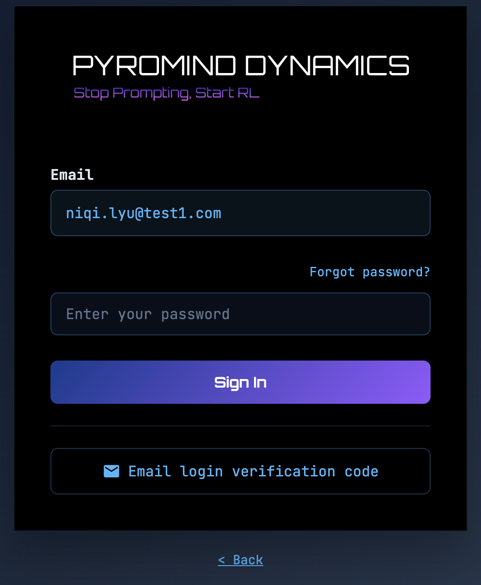
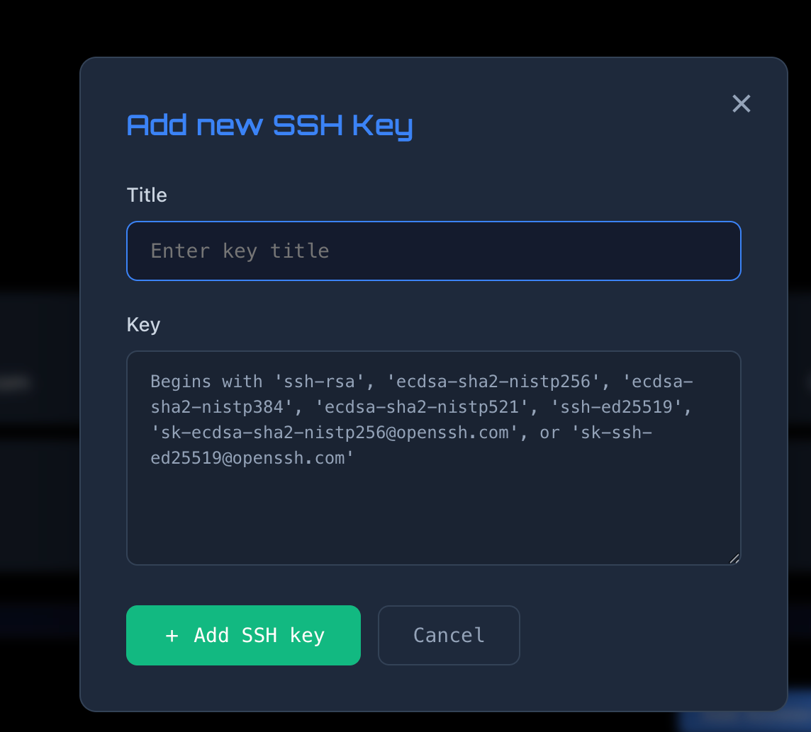
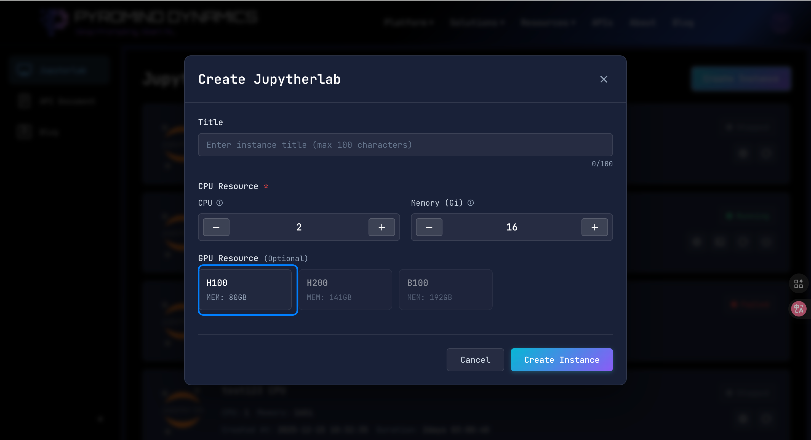
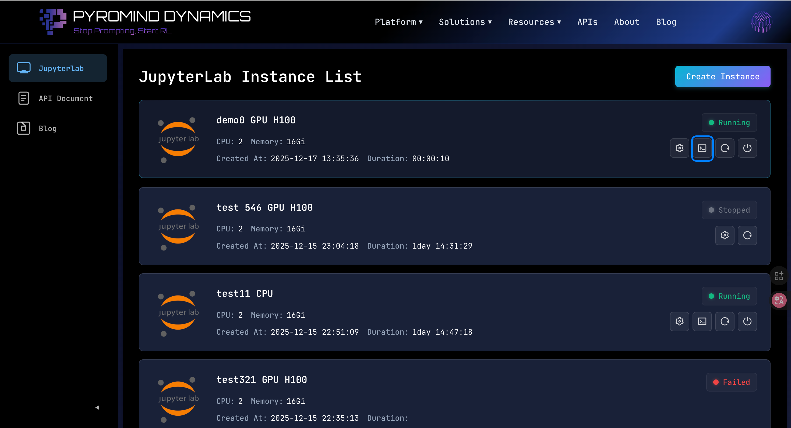
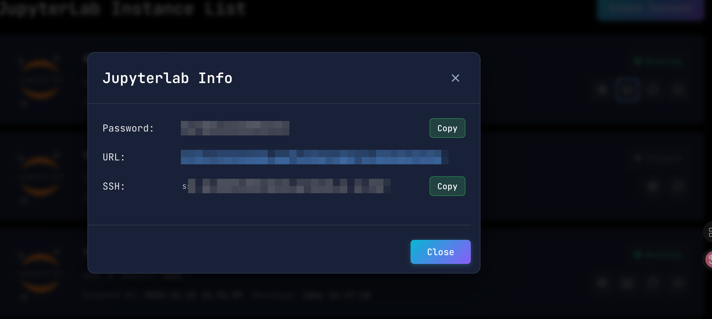

# Create a JupyterLab and SSH to it

This guide explains how to create a JupyterLab instance using PyroMind Website and connect to it via SSH.

## Prerequisites

- A PyroMind account with valid credentials
- Access to the PyroMind platform
- An SSH public key (if you plan to connect via SSH)

## Step 1: Login to PyroMind

First, navigate to the [login page](https://pyromind.ai/login.html?target=%2Fjupyterlab-manage.html) and enter your email address:

Then, enter your password:

## Step 2: Add Your SSH Public Key

Before creating a JupyterLab instance, you need to add your SSH public key to your profile. This is required for SSH connections to your instances.

1. Navigate to your profile page. You can usually find this in the user menu or settings.

2. Access the profile settings page.

3. Locate the SSH key section and click to edit your SSH keys.

4. Click the "Add Key" button to add a new SSH public key.

5. Paste your SSH public key into the input field and save the changes.

> **Note:** If you don't have an SSH key pair yet, you can generate one using `ssh-keygen` command on your local machine.

## Step 3: Navigate to JupyterLab Instance Management

After adding your SSH key, go to the [JupyterLab Instance List](https://pyromind.ai/jupyterlab-manage.html) page to view and manage your instances.

## Step 4: Create a JupyterLab Instance

To create a new JupyterLab instance, follow these steps:

1. Click on the "Create Instance" button on the instance management page.

2. Configure your instance settings (such as instance name, resource allocation, etc.) and confirm the creation.

## Step 5: Connect to the Instance

Once your instance is created and running, you can connect to it in two ways:

### Option 1: Connect via JupyterLab URL

1. Find your instance in the instance list and locate the connection information.

2. Click on the provided URL to open JupyterLab directly in your browser.

### Option 2: Connect via SSH

1. Use the provided SSH command or connection details from the instance information page.

2. Run the SSH command in your terminal to establish a connection to your JupyterLab instance.

## Important Warnings

> ⚠️ **Data Persistence Warning:**
> 
> Please be aware of the following important information about data persistence in JupyterLab instances:
> 
> - **System packages installed via `apt install`** will be **lost** after pausing, stopping, or restarting your instance. These changes are not persisted.
> - **Only data in the following directories will be preserved:**
>   - `/workspace/` - Your workspace directory
>   - `/root/` - Your root home directory
> - **All other changes** (including system-wide configurations, packages installed outside the persistent directories, etc.) **will be overwritten** when the instance is paused, stopped, or restarted.
> 
> **Recommendations:**
> - Store all your important files and projects in `/workspace/` or `/root/`
> - If you need to install packages, consider using Python's `pip` or `conda` and install them in user space or within your workspace directory
> - For system-level packages that you need regularly, consider creating a setup script that you can run after each instance restart

## Additional Notes

- Make sure your instance is in a running state before attempting to connect
- Keep your SSH credentials secure and do not share them
- If you encounter connection issues, verify that your instance is running and check the network settings