# How to train a Compute-Use VLM model to get better performance in windows sandbox?

<div style="display: flex; justify-content: space-around; align-items: center; gap: 10px;">
  <div style="text-align: center;">
    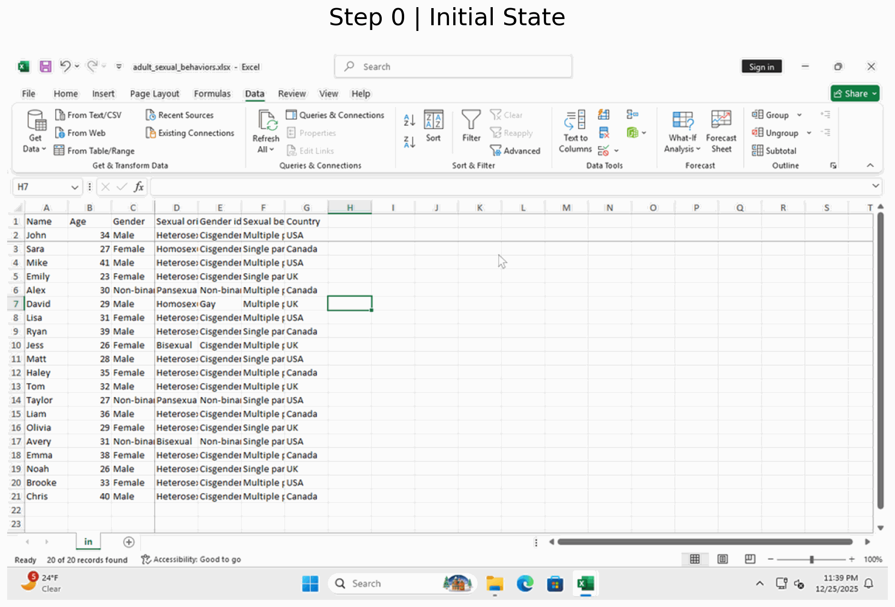
  </div>
</div>

*This GIF showcases the Excel operation capabilities of a GUI Agent trained by **PyroMind.ai**. Given a task instruction and the current screen state, the model generates step-by-step action commands to perform common Excel operations, demonstrating its ability to reason over spreadsheet interfaces and produce structured interaction sequences.*


## 1 Introduction

GUI Agents aim to enable intelligent systems to interact with graphical user interfaces by perceiving screen states and executing low-level actions such as clicks, typing, and window control. While recent Vision-Language Models (VLMs) have shown promising capabilities in understanding visual interfaces and following natural language instructions, directly applying pretrained models to real-world desktop environments often leads to unreliable behavior.

In practice, GUI Agents face several critical challenges, including imprecise GUI grounding, inconsistent action formatting, sensitivity to layout changes, and poor long-horizon task execution in dynamic operating systems such as Windows. These limitations are particularly evident when agents are required to perform common system-level operations or interact with productivity software under real execution constraints.

This work focuses on addressing two foundational capabilities for GUI Agents in Windows sandbox environments: basic Windows system operations (e.g., application launching, window management, file navigation) and Excel-based operations (e.g., cell selection, data entry, formula manipulation). To achieve reliable performance in these scenarios, we adopt targeted training strategies that align visual perception with executable actions and leverage execution feedback to improve robustness. By strengthening these core capabilities, we aim to provide a practical and scalable foundation for more complex desktop automation tasks.


## 2 Datasets
### 2.1 Overview
To support reliable GUI Agent training in Windows sandbox environments, we construct and adopt task-specific datasets targeting both system-level and application-level operations.

For basic Windows system operations, we use pyromind-gui-win, a self-collected dataset inspired by **ScreenAgent** [[1]](#ref1). This dataset focuses on fundamental OS interactions such as application launching, window switching, file navigation, and basic input control. The data is collected from real Windows environments and emphasizes fine-grained perception–action alignment under dynamic UI states.


For Excel operation capabilities, we leverage gui-excel, a subset of the **GUI-360°** [[2]](#ref2) dataset that concentrates on spreadsheet-related tasks. This dataset covers common Excel interactions including cell selection, text and numeric input, formula editing, and table manipulation, providing diverse task trajectories with realistic UI variations.


### 2.2 Data Collection Workflow

The data collection process follows a unified **computer control workflow** consisting of **planning, acting, and reflecting** phases.
Given a user task prompt, the agent first decomposes the task into a sequence of subtasks. For each subtask, the agent observes the current screen, produces a structured description of the UI state, and generates executable mouse and keyboard operations in a function-call style. After execution, the agent enters a reflection phase, where it decides whether to proceed to the next subtask, retry the current one, or revise the overall plan based on execution feedback.

This iterative planning–acting–reflecting loop enables the collection of high-quality, temporally coherent interaction trajectories, covering both successful executions and recovery behaviors. The resulting data provides strong supervision for learning robust perception–action alignment in dynamic desktop environments.


*Figure 1 illustrates the overview of the computer control workflow. Sub-figure (a) shows the flowchart of the planning, acting, and reflecting process, while sub-figure (b) presents an illustrative example of a multi-step GUI task execution[[1]](#ref1).*


### 2.3 Data Format

Organize pyromind-gui-win in the following structure:
``` bash
pyromind-gui-win /
├── data/
│   └── *.jsonl      # Trajectory files
└── image/
    ├── <jsonl_name>/
    │   └── *.png          # Screenshots
```
Download the gui-excel dataset (the Excel subset of GUI-360°) and organize it in the following structure:
``` bash
gui-excel /
├── data/
│   ├── excel/                
│   │   ├── <category>/         # e.g., in_app, online, search
│   │   │   └── success/
│   │   │       └── *.jsonl      # Trajectory files
└── image/
    ├── excel/
    │   ├── <category>/
    │   │   └── success/
    │   │       └── <jsonl_name>/
    │   │           └── *.png          # Screenshots
```


The dataset is stored in **JSONL** format, where each line corresponds to a **single interaction step** within a GUI task execution trajectory. A complete task consists of multiple sequential steps, all sharing the same `execution_id`.

Each record contains the following fields:

* **execution_id**
  A unique identifier for a complete GUI task instance. All steps belonging to the same task share the same `execution_id`.

* **request**
  The original high-level user instruction describing the overall task objective (e.g., an Excel operation or system-level action).

* **step_id**
  The index of the current step within the task trajectory, starting from 1.

* **total_steps**
  The total number of steps required to complete the task, enabling explicit modeling of long-horizon execution.

* **step**
  A structured representation of the current interaction step, including perception, reasoning, and action components:

  * **screenshot_clean**: Path to the GUI screenshot observed at the current step.
  * **subtask**: A localized sub-goal corresponding to the current step.
  * **observation**: A textual description of the current GUI state.
  * **thought**: The intermediate reasoning guiding action selection.
  * **action**: The executable GUI action, consisting of:

    * **function**: Action type (e.g., `click`, `type`, `scroll`, `terminate`).
    * **args**: Action parameters such as mouse button, coordinates, and click type.
    * **rectangle**: The bounding box of the target UI element in screen coordinates.
  * **status**: Execution state indicator (e.g., `CONTINUE`, `FINISH`).

This step-level design explicitly aligns **visual perception**, **language reasoning**, and **low-level actions**, making the dataset suitable for supervised fine-tuning and reinforcement learning of GUI Agents in dynamic Windows environments.

### 2.4 Example
Below is an example of a single step in a GUI task trajectory.
```json
  {
    "execution_id": "excel_3_1527",
    "request": "Remove any custom embedded data or Power Pivot data from the Excel workbook to ensure compatibility with earlier versions of Excel.",
    "step_id": 1,
    "total_steps": 8,
    "step":
    {
        "screenshot_clean": "success/excel_3_1527/action_step1.png",
        "subtask": "Remove any custom embedded data or Power Pivot data from the currently opened Excel workbook, 'm365_help_doc_310002841'.",
        "observation": "The current screenshots show the Excel workbook titled 'm365_help_doc_310002841' opened. The workbook appears to be in the normal editing view with various columns and rows visible. In the last step, the Excel application was successfully opened and focused.",
        "thought": "I need to check the workbook for any custom embedded data or Power Pivot data. To start the process, I will click on the 'File Tab' to access the backstage view where I can find options to inspect and adjust the workbook settings for compatibility.",
        "action":
        {
            "function": "click",
            "args":
            {
                "button": "left",
                "double": false,
                "x": 39.0,
                "y": 71.0
            },
            "rectangle":
            {
                "left": 12,
                "top": 56,
                "right": 66,
                "bottom": 86
            }
        },
        "status": "CONTINUE"
    }
  }
```

### 2.5 Conversion to Qwen3-VL Training Format

To train **Qwen3-VL** [[3]](#ref3) for multi-step GUI interaction tasks, we convert the original step-level JSONL data into a structured multimodal dialogue format that explicitly models **sequential decision-making**. Each interaction step is converted into an independent training sample while preserving temporal dependencies through prior-step reasoning.

For each step, the **current screenshot** (`screenshot_clean`) is used as the visual input. The **user prompt** is constructed using three components only: the visual observation (image), the original high-level task request, and the **thoughts from all previous steps** within the same execution trajectory. 

The **assistant output** represents the model’s decision at the current step and includes three elements: the current step’s reasoning (`thought`), the executable GUI action (`action`), and the execution state (`status`). Together, these fields define a complete decision unit for the GUI Agent at that step.

Below is an example of the converted training sample in the Qwen3-VL format.
```json
{
 "images": ["<image>"],
 "messages": [
     {
         "role": "system",
         "content": [{"type": "text", "text": "<system_prompt>"}]
     },
     {
         "role": "user",
         "content": [
             {"type": "image", "image": "<image>"},
             {"type": "text", "text": "<user_prompt>"}
         ]
     },
     {
         "role": "assistant",
         "content": [{"type": "text", "text": "<assistant_response>"}]
     }
 ]
}
```

```
<user_prompt>
You are a helpful assistant. Given a screenshot of the current screen, user instruction and history of actions, you need to decide the next action to take.

The instruction is:
{instruction}

The history of actions are:
{history}

The actions supported are:
{actions}
Important: All coordinate parameters for a predicted action must be absolute pixel positions on the screen, e.g., click(coordinate=[100, 200], button='left', double=False, pressed=None)

First, explain your reasoning process—describe how you analyze the screenshot, understand the current state, and determine what action should be taken next based on the instruction and previous actions.

Then output your action within <tool_call></tool_call> tag like:
<tool_call>
{{
  "function": "<function name>",
  "args": {{}},
  "status": "CONTINUE"
}}
</tool_call>

If you think the task is finished, you can output status as "FINISH" and take no action. Like:
<tool_call>
{{
  "function": "",
  "args": {{}},
  "status": "FINISH"
}}
</tool_call>

Only **ONE** action should be taken at a time. If the instruction could apply to multiple elements, choose the most relevant one based on the context provided by the screenshot and previous actions.
```
```
<assistant_response>
I need to check the workbook for any custom embedded data or Power Pivot data. To start the process, I will click on the 'File Tab' to access the backstage view where I can find options to inspect and adjust the workbook settings for compatibility.<tool_call>\n{\n    "function": "click",\n    "args": {\n        "button": "left",\n        "double": false,\n        "coordinate": [38, 96]\n    },\n    "status": "CONTINUE"\n}\n</tool_call>'}],
 'action': '{"function": "click", "args": {"button": "left", "double": false, "coordinate": [38, 96]}, "status": "CONTINUE", "bbox": [12, 76, 63, 117]}
```


> **Note:** Qwen3-VL uses a relative coordinate system ranging from 0 to 1000. All GUI action coordinates (e.g., click positions and bounding boxes) should be normalized to this range, rather than using absolute pixel coordinates as in Qwen2.5-VL.


## 3 Training Method

We adopt a **two-stage training workflow** to equip the GUI Agent with reliable GUI grounding and structured action generation capabilities. The workflow consists of **Supervised Fine-Tuning (SFT)** followed by **Reinforcement Learning (RL)**, where the former establishes a strong initialization and the latter further refines decision quality through objective evaluation of generated actions.

### 3.1 Supervised Fine-Tuning

In the first stage, we perform supervised fine-tuning on **Qwen3-VL-4B-Instruct** to adapt the pretrained vision-language model to GUI interaction tasks. To achieve efficient adaptation with limited computational overhead, we employ **LoRA-based parameter-efficient fine-tuning**, keeping the backbone parameters frozen while updating a small set of task-specific adapters.

The supervised objective maximizes the likelihood of ground-truth outputs given the visual observation, user instruction, and interaction history. Training samples are constructed at the step level, explicitly aligning screenshots with structured GUI action outputs. This stage enables the model to learn accurate GUI grounding, action representation, and step-wise reasoning required for compute-use tasks.

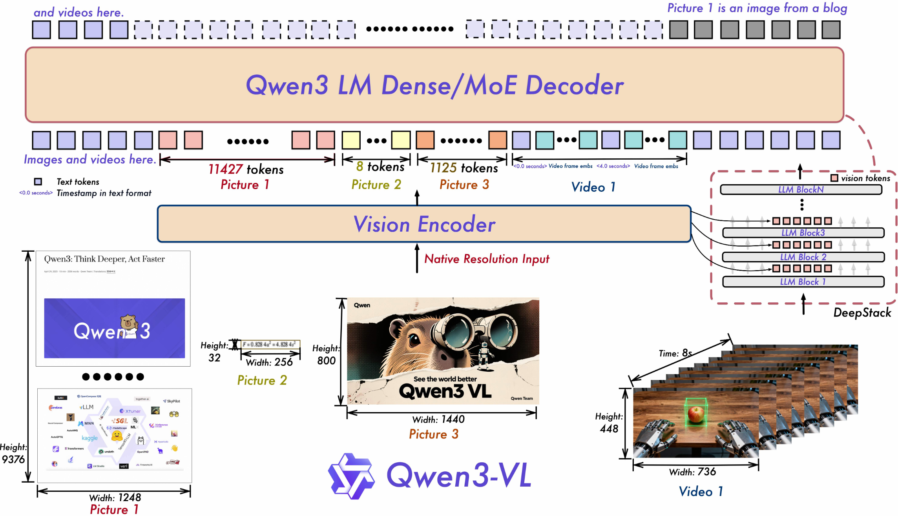

*Figure 2 illustrates the overall architecture of Qwen3-VL[[3]](#ref3).*

### 3.2 Reinforcement Learning

Starting from the SFT-trained model, we further refine the policy using **reinforcement learning based on Group Relative Policy Optimization (GRPO)**[[4]](#ref4). In this stage, the model generates multiple candidate outputs for the same input, which are then evaluated using objective criteria to obtain relative preference signals.

GRPO updates the policy by comparing the relative quality of generated outputs within a group, encouraging the model to assign higher probability to more desirable action sequences while constraining policy deviation. This optimization focuses on improving output consistency, action correctness, and long-horizon decision quality beyond supervised learning.

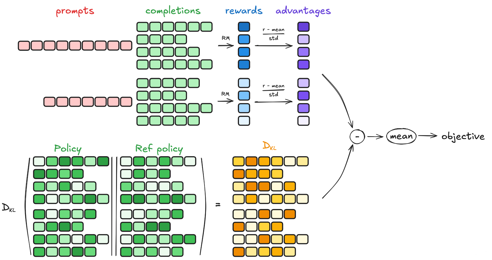

*Figure 3 shows the GRPO-based optimization framework applied in the reinforcement learning stage[[5]](#ref5).*

Through this two-stage training process, the GUI Agent achieves both strong initial grounding from supervised data and refined action selection through preference-based reinforcement learning.


## 4 Workflows

The overall training workflow is built on a **self-developed, node-based visual workflow framework**, which represents the entire GUI Agent training process as a configurable computation graph. Each node encapsulates a core training function, such as dataset loading, model initialization, training parameter configuration, and optimization execution. By connecting these nodes through a drag-and-drop interface, users can flexibly construct and modify training workflows without relying on low-level training scripts.
### 4.1 Supervised Fine-Tuning Workflow
In the **supervised fine-tuning stage**, the workflow is composed of a standard set of nodes, including a dataset loading node, a pretrained model loading node, a training configuration node, and an SFT execution node. These nodes jointly define the data flow and optimization behavior of the training process. This visual abstraction allows users to easily adjust datasets, models, and hyperparameters while maintaining a clear and interpretable training structure.You can download the workflow diagram and try it for yourself using the following link: [Download Supervised Fine-Tuning Workflow](jsons/gui_train_sft.json)

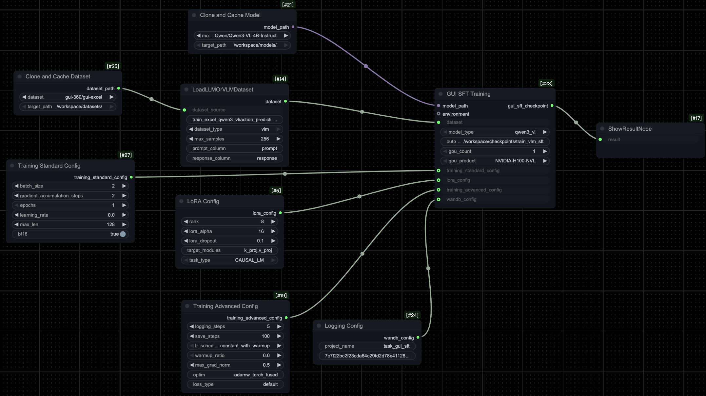

*Figure 4 illustrates the node-based workflow used for supervised fine-tuning.*


### 4.2 Reinforcement Learning Workflow

The **reinforcement learning workflow** follows a workflow structure similar to supervised fine-tuning, and is used to further optimize the model after SFT. In this stage, the model generates multiple candidate action sequences for the same input, which are evaluated using predefined objective criteria to obtain relative preference signals. The optimization process is carried out using Group Relative Policy Optimization (GRPO), focusing on improving action quality and decision consistency.You can download the workflow diagram and try it for yourself using the following link: [Download Reinforcement Learning Workflow](jsons/gui_train_grpo.json)

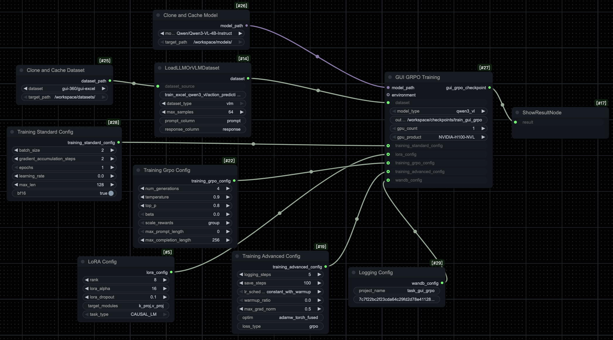

*Figure 5 illustrates the GRPO-based reinforcement learning workflow.*


### 4.3 Inference
The **inference workflow** specifies how the trained GUI Agent produces outputs during deployment. Given a user instruction and the current screen observation, the model generates structured thoughts and action commands in a step-by-step manner. You can download the workflow diagram and try it for yourself using the following link: [Download Inference Workflow](jsons/gui_inference.json)

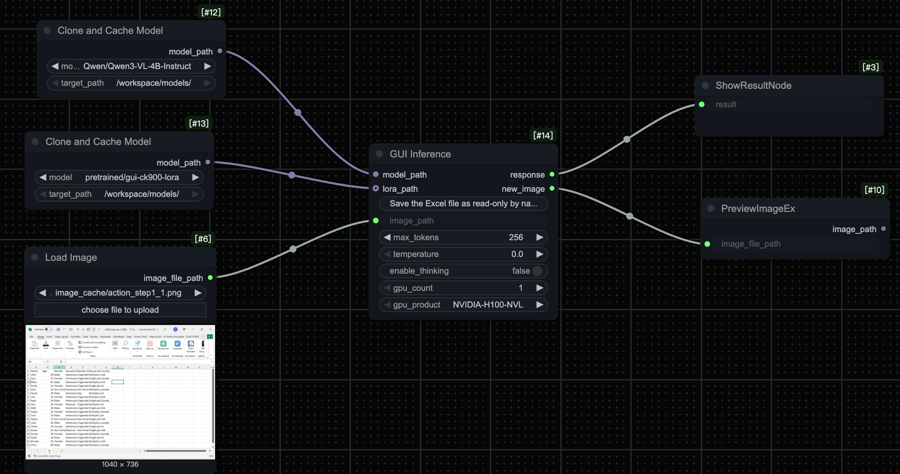

*Figure 6 illustrates the inference workflow.*

## 5 Performance
### 5.1 Evaluation Results

We evaluate the model across different training stages, including **Baseline (Qwen3-VL-4B-Instruct)**, **Supervised Fine-Tuning (SFT)**, and **Reinforcement Learning (GRPO)**, on two datasets: **pyromind-gui-win** for Windows basic operations and **gui-excel** for Excel operations. The results are summarized in Table 1.

**Table 1.** Performance comparison of Baseline, SFT, and GRPO models on pyromind-gui-win and gui-excel.

| Dataset          | Baseline | SFT    | GRPO   |
| ---------------- |----------|--------|--------|
| pyromind-gui-win | 66.87%   | 78.72% | 89.13% |
| gui-excel        | 23.09%   | 35.5%  | 40.2%  |


### 5.2 Case Study: Windows Sandbox Performance

The following cases demonstrate the progressive improvement of the model's performance in Windows sandbox environments.

#### **Task Prompt**: "Unpin Documents from Quick Access"
<div style="display: flex; justify-content: space-around; align-items: center; gap: 10px;">
  <div style="text-align: center;">
    <p><strong>Before Training</strong></p>
    
  </div>
  <div style="text-align: center;">
    <p><strong>After SFT</strong></p>
    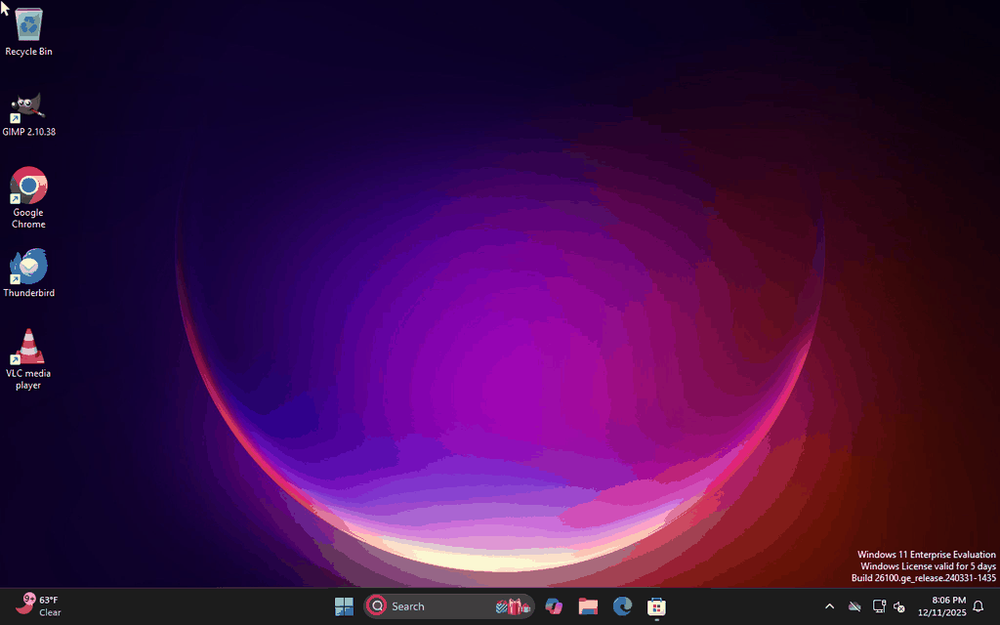
  </div>
  <div style="text-align: center;">
    <p><strong>After GRPO</strong></p>
    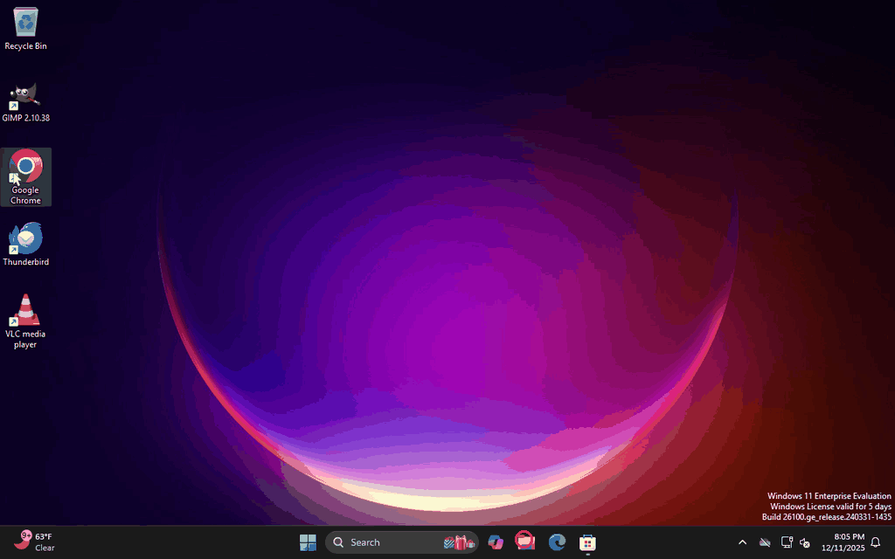
  </div>
</div>

#### **Task Prompt**: "Open Windows Firewall notification settings"
<div style="display: flex; justify-content: space-around; align-items: center; gap: 10px;">
  <div style="text-align: center;">
    <p><strong>Before Training</strong></p>
    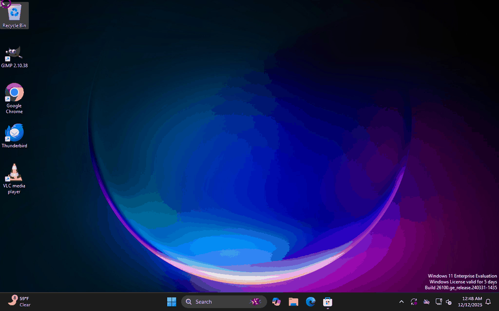
  </div>
  <div style="text-align: center;">
    <p><strong>After SFT</strong></p>
    
  </div>
  <div style="text-align: center;">
    <p><strong>After GRPO</strong></p>
    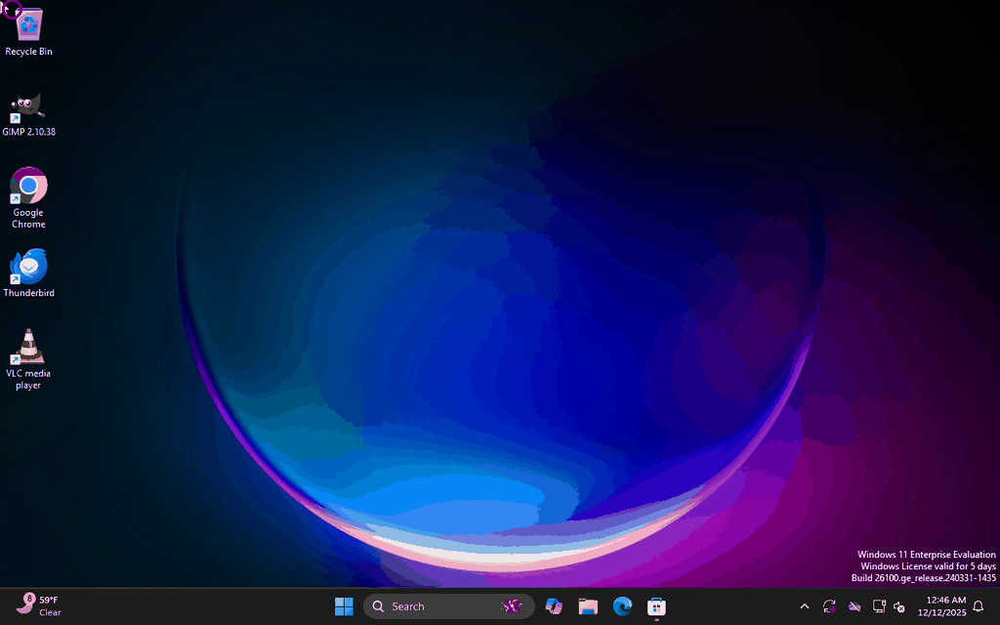
  </div>
</div>

#### **Task Prompt**: Save the Excel file as read-only by navigating to the File tab, selecting Info, and choosing Protect Workbook to set it to always open as read-only."
<div style="display: flex; justify-content: space-around; align-items: center; gap: 10px;">
  <div style="text-align: center;">
    <p><strong>Step 0</strong></p>
    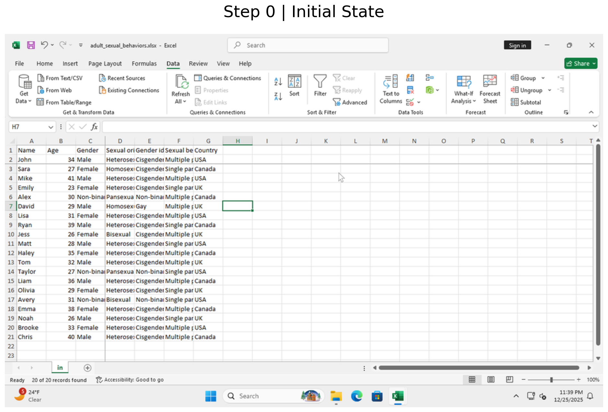
  </div>
  <div style="text-align: center;">
    <p><strong>Step 1</strong></p>
    
  </div>
  <div style="text-align: center;">
    <p><strong>Step 2</strong></p>
    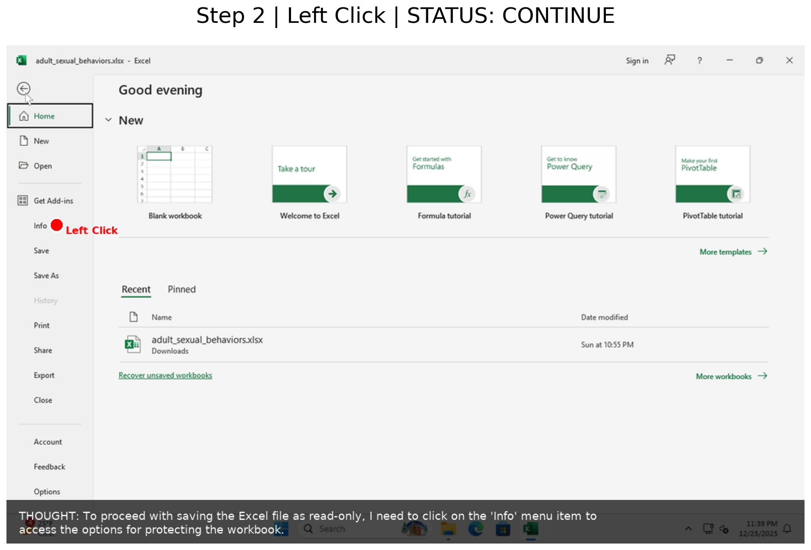
  </div>
</div>
<div style="display: flex; justify-content: space-around; align-items: center; gap: 10px;">
  <div style="text-align: center;">
    <p><strong>Step 3</strong></p>
    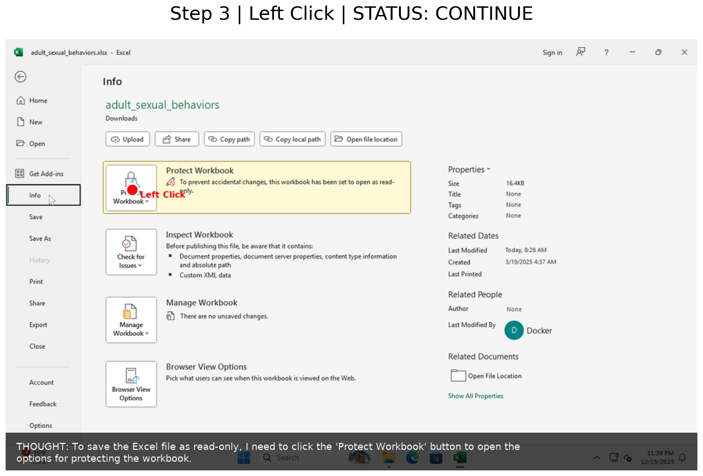
  </div>
  <div style="text-align: center;">
    <p><strong>Step 4</strong></p>
    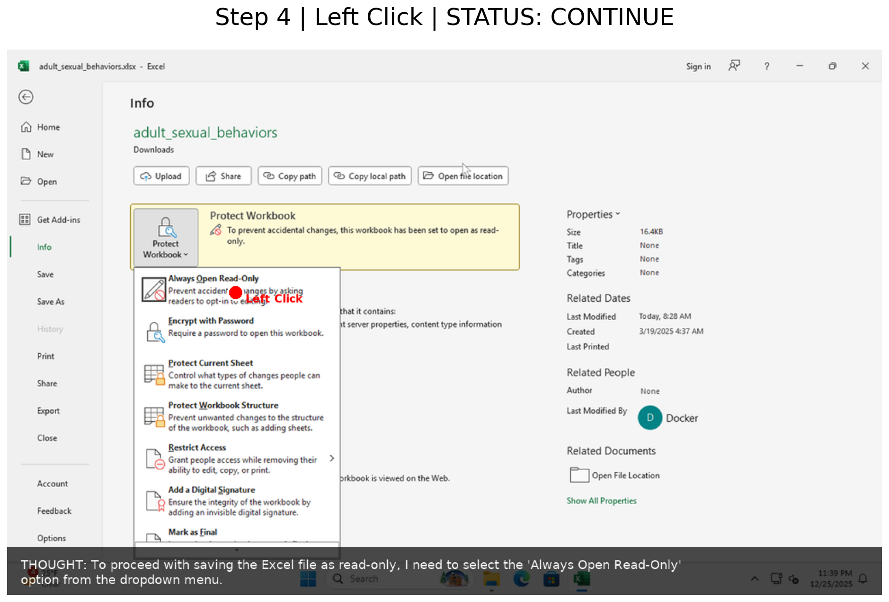
  </div>
  <div style="text-align: center;">
    <p><strong>Step 5</strong></p>
    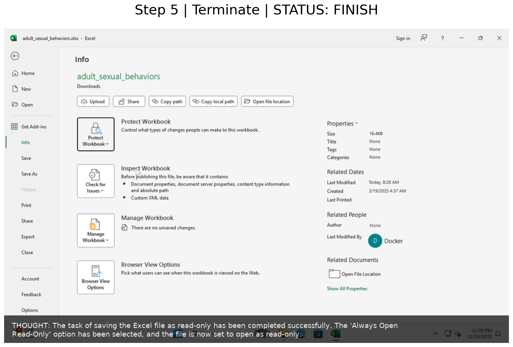
  </div>
</div>

## References

<a id="ref1"></a>1. Niu R, Li J, Wang S, et al. Screenagent: A vision language model-driven computer control agent[J]. arXiv preprint arXiv:2402.07945, 2024.

<a id="ref2"></a>2. Mu J, Zhang C, Ni C, et al. GUI-360$^\circ $: A Comprehensive Dataset and Benchmark for Computer-Using Agents[J]. arXiv preprint arXiv:2511.04307, 2025.

<a id="ref3"></a>3. Bai S, Chen K, Liu X, et al. Qwen2. 5-vl technical report[J]. arXiv preprint arXiv:2502.13923, 2025.

<a id="ref4"></a>4. Shao Z, Wang P, Zhu Q, et al. Deepseekmath: Pushing the limits of mathematical reasoning in open language models[J]. arXiv preprint arXiv:2402.03300, 2024.

<a id="ref5"></a>5. Hugging Face. GRPO trainer: TRL documentation[EB/OL]. https://huggingface.co/docs/trl/main/grpo_trainer, 2025-12-30.

