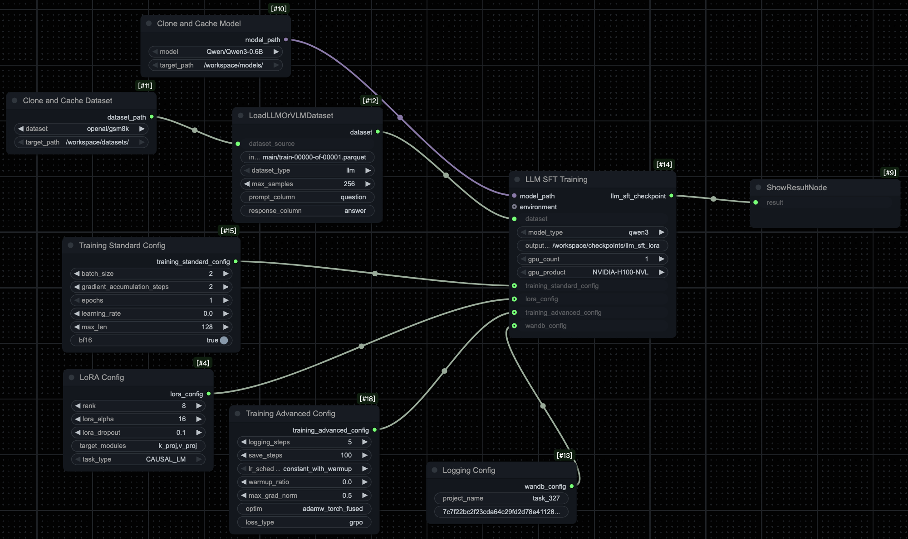
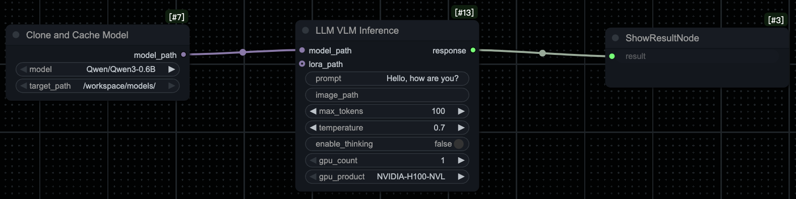
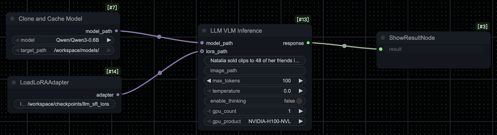

# How to train and inference VLM/LLM models using Training Studio?

This guide will help you get started with the **Training Studio** for both **training** and **inference** tasks using **LLMs** and **VLMs**. The guide walks through the necessary steps to train a model with **Supervised Fine-Tuning (SFT)**, and then use the trained model for inference with three different configurations: **LLM Inference**, **LLM Inference with LoRA**, and **VLM Inference**.

---

## **1. Fine-Tuning a Model (Supervised Fine-Tuning)**

### **1.1 Prepare Your Dataset**

* **Dataset Format**: Ensure that your dataset contains labeled data. For a **customer support Q&A** task, your dataset might look like:

  * **question**: "Natalia sold clips to 48 of her friends in April, and then she sold half as many clips in May. How many clips did Natalia sell altogether in April and May?"
  * **answer**: "Natalia sold 48/2 = <<48/2=24>>24 clips in May. \nNatalia sold 48+24 = <<48+24=72>>72 clips altogether in April and May.\n#### 72"

### **1.2 Fine-Tune Your Model**

1. **Download the workflow**: [Download **llm_train_sft** workflow](jsons/llm_train_sft.json) (Supervised Fine-Tuning LLMs with LoRA), then drag and drop it into the Studio.  
   **Note**: By default, training is done using LoRA for memory efficiency and faster inference.
2. **Load your dataset** into the platform.
3. **Select the llm_train_sft workflow** for training, which automatically applies LoRA to enhance memory efficiency and speed.
4. Configure the hyperparameters (e.g., learning rate, batch size).
5. **Run the workflow** to fine-tune the model.

After fine-tuning, your model will be optimized for the specific task. Below is an example of the training workflow interface:

*Figure 1: Fine-tuning the LLM using the llm_train_sft workflow.*

---

## **2. Running Inference**

After fine-tuning the model, you can use the trained model for inference. Choose and download the appropriate workflow, then drag and drop it into the Studio:

* [Download **llm_inference** workflow](jsons/llm_inference.json) - Standard LLM inference for general text-based queries
* [Download **llm_inference_lora** workflow](jsons/llm_inference_lora.json) - Inference with LoRA adapter support
* [Download **vlm_inference** workflow](jsons/vlm_inference.json) - For tasks involving both visual and textual data (e.g., VQA or GUI interaction)

Once the workflow is loaded:

1. **Provide your input** (e.g., a customer query or an image and text for VLM inference).
2. **Execute the workflow** to generate the response or action based on the input.

The following figures show examples of each inference workflow:

*Figure 2: Running inference using the llm_inference workflow.*

*Figure 3: Running inference using the llm_inference_lora workflow.*

*Figure 4: Running inference using the vlm_inference workflow.*

---

## **3. Evaluation**

After running inference, evaluate the model's performance based on the relevance and accuracy of its responses. You can further fine-tune or adjust your dataset and configuration as needed to improve performance.

---

## **4. Conclusion**

The **Training Studio** provides an intuitive, node-based environment for both training and inference tasks. Whether fine-tuning models for specific tasks or running inference to generate responses or actions, the platform allows for efficient management of machine learning workflows. With support for both LLM and VLM tasks, you can quickly deploy pre-trained models for real-world applications.

