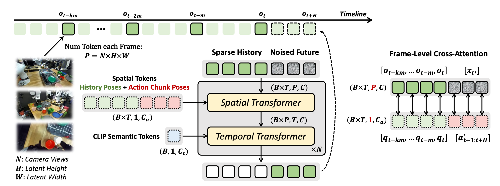
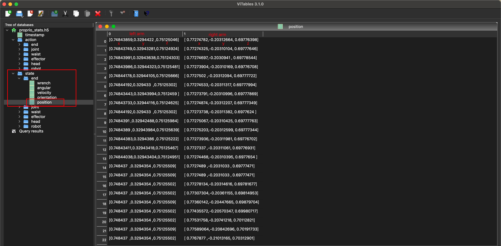
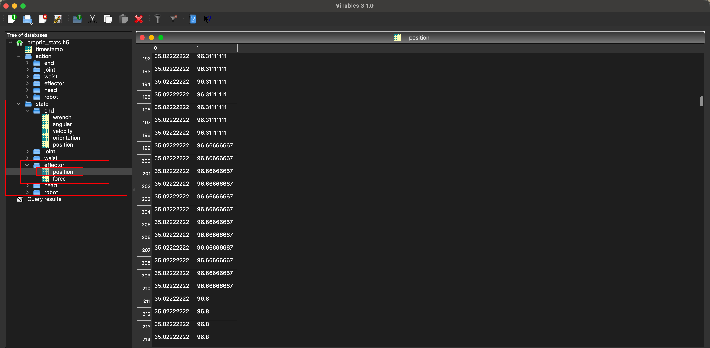
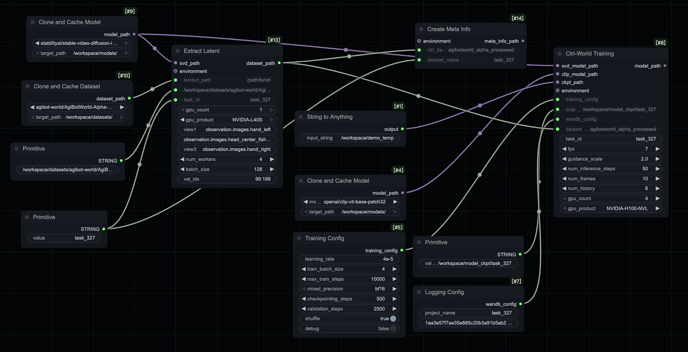
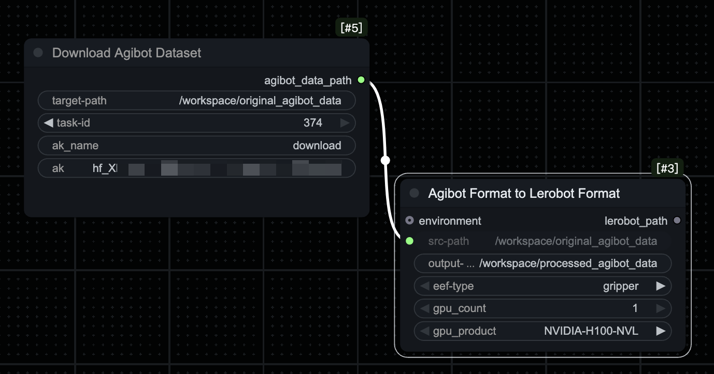
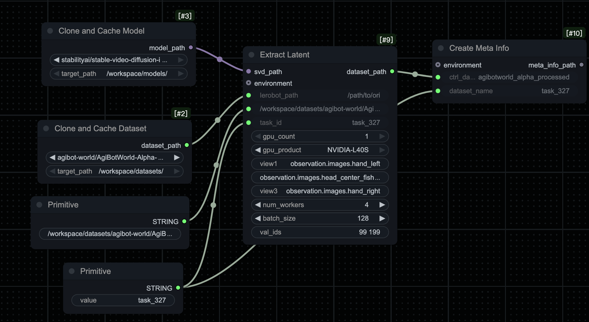
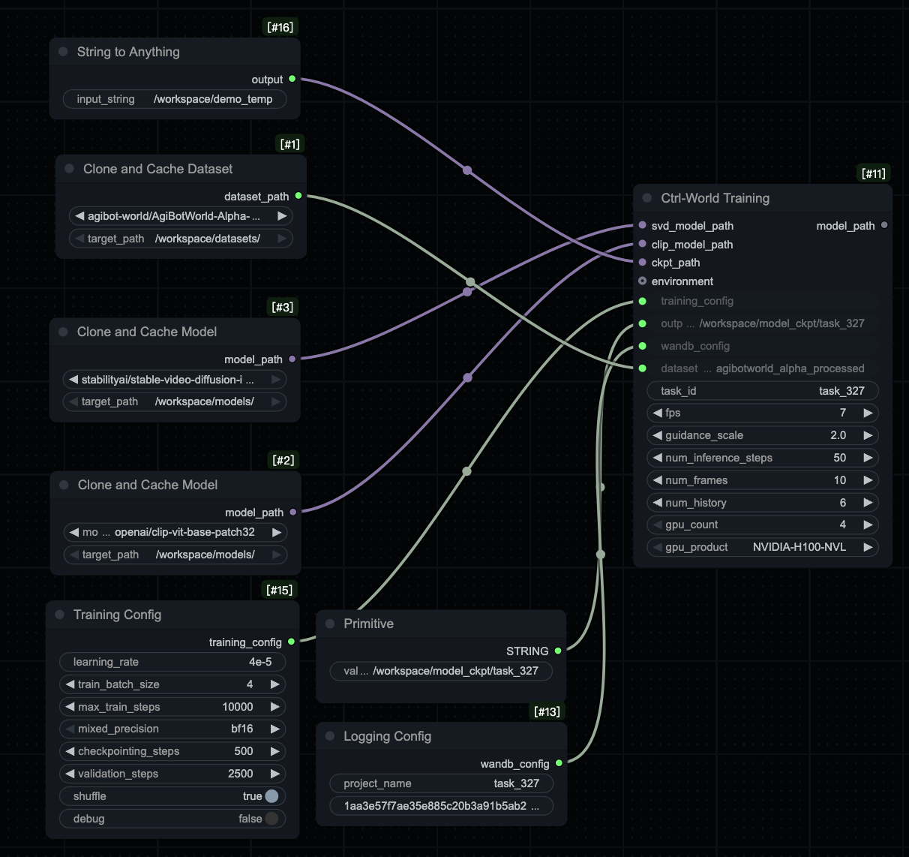
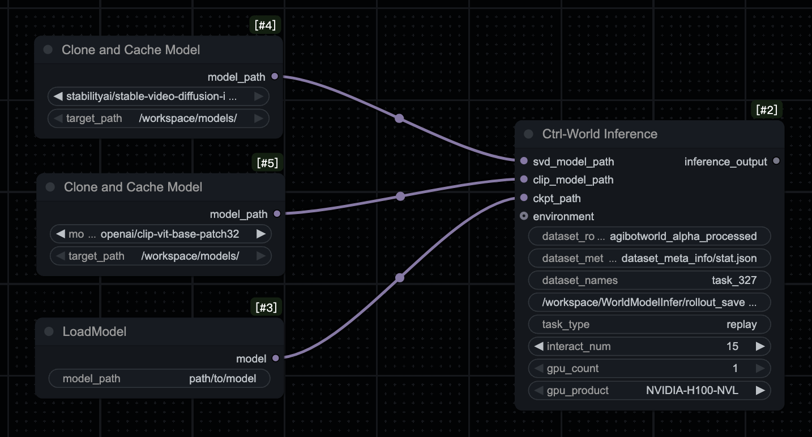
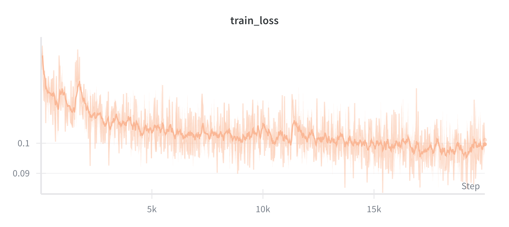

# How to train a World Model with AgibotWorld-Alpha in a few clicks?

<video controls width="100%">
  <source src="videos/show_case0.mp4" type="video/mp4">
  Your browser does not support the video tag.
</video>

*This video showcases the world model trained by PyroMind.ai. The upper section displays the ground truth from three camera perspectives, while the lower section shows predictions generated by the model on validation set samples from three corresponding perspectives.*


## Introduction

Vision-Language-Action (VLA) systems have shown remarkable potential in robotics and embodied AI applications. However, one of the most critical bottlenecks limiting their widespread adoption is the scarcity of high-quality, diverse training datasets. World models have emerged as a powerful solution to this challenge, offering a way to learn and simulate complex environments, thereby reducing the dependency on extensive real-world data collection.

Among the state-of-the-art world models, **Ctrl-World** [[1]](#ref1) stands out as a controllable generative world model for robot manipulation. Initially pretrained on the DROID dataset, Ctrl-World demonstrates strong capabilities in generating realistic manipulation scenarios. However, the DROID dataset is relatively simple with limited degrees of freedom and differs significantly from real-world robot operations. To validate the effectiveness of this approach in more realistic and complex scenarios, we fine-tune Ctrl-World on the larger-scale **AgibotWorld-Alpha** dataset and build a visual workflow to facilitate the training process.

By training on the AgibotWorld-Alpha dataset, we aim to provide a user-friendly visual training workflow that facilitates training for customers with limited computing resources and experience. By transforming the entire world model training workflow into an intuitive drag-and-drop experience, we reduce the underlying complexities of data preprocessing, model training, and configuration management, enabling users with varying technical backgrounds to efficiently build, customize, and deploy world model solutions. Through our visual interface, users can effortlessly configure data workflows, adjust training parameters, monitor training progress in real-time, and manage model artifacts—all with just a few clicks.

## Model Architecture

Ctrl-World is built upon a foundation of pretrained vision and diffusion models, enhanced with specialized components for controllable robot manipulation prediction. The architecture consists of several key components:

### Foundation Models

- **Stable-Video-Diffusion (SVD)**: Ctrl-World leverages the pretrained [Stable-Video-Diffusion](https://huggingface.co/stabilityai/stable-video-diffusion-img2vid) model [[2]](#ref2) as its core video generation backbone. This diffusion model provides strong priors for generating realistic video sequences.

- **Contrastive Language-Image Pre-Training (CLIP)**: The model incorporates [CLIP](https://huggingface.co/openai/clip-vit-base-patch32) [[3]](#ref3) for visual feature encoding, enabling effective representation learning from multi-view inputs.

- **Variational Autoencoder (VAE)**: During preprocessing and training, a VAE is used to extract latent representations from video frames, significantly reducing computational complexity while preserving essential visual information.

### Key Architectural Components

1. **Multi-View Input Processing**: Ctrl-World simultaneously processes both third-person and first-person (wrist-mounted) camera perspectives. A spatial Transformer module aligns and concatenates features from multiple viewpoints, enabling cross-view spatial relationship modeling for more accurate trajectory predictions.

2. **Frame-Level Action Conditioning**: Unlike traditional video generation models, Ctrl-World receives fine-grained action instructions at each frame, ensuring that the generated sequences accurately reflect the robot's operations at different time steps. This frame-level control mechanism enhances the model's capability to handle complex manipulation tasks.

3. **Pose-Conditioned Memory Retrieval**: To ensure long-term consistency in generated sequences, Ctrl-World incorporates a memory retrieval mechanism. By sampling key frames from historical trajectories and embedding robot arm pose information into visual features, the model can retrieve similar historical frames during prediction, calibrating current predictions to maintain temporal coherence over extended sequences.

These components work synergistically to enable high-fidelity, controllable, and temporally consistent virtual task rehearsal, providing robust support for robot strategy evaluation and optimization.


## Datasets
``` bash
├── task_info
│   ├── task_327.json
│   ├── task_352.json
│   └── ...
├── observations
│   ├── 327 # This represents the task id.
│   │   ├── 648642 # This represents the episode id.
│   │   │   ├── depth # This is a folder containing depth information saved in PNG format.
│   │   │   ├── videos # This is a folder containing videos from all camera perspectives.
│   │   └── ...
│   └── ...
├── parameters
│   ├── 327
│   │   ├── 648642
│   │   │   ├── camera
│   │   └── ...
│   └── 352
│       ├── 648544
│       │   ├── camera # This contains all the cameras' intrinsic and extrinsic parameters.
|       └── ...
├── proprio_stats
│   ├── 327
│   │   ├── 648642
│   │   │   ├── proprio_stats.h5 # This file contains all the robot's proprioceptive 
```

The structure of the AgibotWorld-Alpha dataset is as follows:

* **`task_info`**: Contains metadata for the project, including the task name, initial scene description (as text), and label information for each episode.

  Here's an example of task_info

  ```json
  [
      {
          "episode_id": 648649,
          "label_info": {
              "action_config": [
                  {
                      "start_frame": 8,
                      "end_frame": 218,
                      "action_text": "Retrieve cucumber from the shelf.",
                      "skill": "Pick"
                  },
                  {
                      "start_frame": 218,
                      "end_frame": 436,
                      "action_text": "Place the held cucumber into the plastic bag in the shopping cart.",
                      "skill": "Place"
                  }
              ]
          },
          "task_name": "Pickup items in the supermarket",
          "init_scene_text": "The robot is positioned in front of the fruit stand in the supermarket environment."
      }
  ]
  ```

  

* **`observations`**: Stores per-camera sensory data aligned by episode—specifically, depth images (in PNG format) and videos (in MP4 format).

* **`parameters`**: Holds calibration and configuration parameters for each camera. Note that this information is **not used** in our Ctrl-World model.

* **`proprio_stats`**： Contains the robot’s proprioceptive states across all episodes. This includes the most **critical** information about the robot’s movements and joint configurations. 

The table below provides a detailed description of the robot's proprioceptive recorded in `proprio_stats`.

| Group | Shape | Description |
|-------|-------|-------------|
| **State Fields** | | |
| `/timestamp` | `[N]` | Timestamp in nanoseconds |
| `/state/effector/position (gripper)` | `[N, 2]` | Left `[:, 0]`, right `[:, 1]`, gripper open range in mm |
| `/state/effector/position (dexhand)` | `[N, 12]` | Left `[:, :6]`, right `[:, 6:]`, joint angle in rad |
| `/state/end/orientation` | `[N, 2, 4]` | Left `[:, 0, :]`, right `[:, 1, :]`, flange quaternion with xyzw |
| `/state/end/position` | `[N, 2, 3]` | Left `[:, 0, :]`, right `[:, 1, :]`, flange xyz in meters |
| `/state/head/position` | `[N, 2]` | Yaw `[:, 0]`, pitch `[:, 1]`, rad |
| `/state/joint/current_value` | `[N, 14]` | Left arm `[:, :7]`, right arm `[:, 7:]` |
| `/state/joint/position` | `[N, 14]` | Left arm `[:, :7]`, right arm `[:, 7:]`, rad |
| `/state/robot/orientation` | `[N, 4]` | Quaternion in xyzw, yaw only |
| `/state/robot/position` | `[N, 3]` | Xyz position, where z is always 0 in meters |
| `/state/waist/position` | `[N, 2]` | Pitch `[:, 0]` in rad, lift `[:, 1]` in meters |
| **Action Fields** | | |
| `/action/*/index` | `[M]` | Action indexes refer to when the control source is actually sending signals |
| `/action/effector/position (gripper)` | `[N, 2]` | Left `[:, 0]`, right `[:, 1]`, 0 for full open and 1 for full close |
| `/action/effector/position (dexhand)` | `[N, 12]` | Same as `/state/effector/position (dexhand)` |
| `/action/effector/index` | `[M_1]` | Index when effector controller sends control signals |
| `/action/end/orientation` | `[N, 2, 4]` | Same as `/state/end/orientation` |
| `/action/end/position` | `[N, 2, 3]` | Same as `/state/end/position` |
| `/action/end/index` | `[M_2]` | Same as `/action/effector/index` |
| `/action/head/position` | `[N, 2]` | Same as `/state/head/position` |
| `/action/head/index` | `[M_3]` | Same as `/action/effector/index` |
| `/action/joint/position` | `[N, 14]` | Same as `/state/joint/position` |
| `/action/joint/index` | `[M_4]` | Same as `/action/effector/index` |
| `/action/robot/velocity` | `[N, 2]` | Velocity along x axis `[:, 0]`, yaw rate `[:, 1]` |
| `/action/robot/index` | `[M_5]` | Same as `/action/effector/index` |
| `/action/waist/position` | `[N, 2]` | Same as `/state/waist/position` |
| `/action/waist/index` | `[M_6]` | Same as `/action/effector/index` |

To help everyone become more familiar with the AgibotWorld-Alpha dataset and Ctrl-World, I’ll provide concrete examples of the data actually used by Ctrl-World.


The image above illustrates the data format for `/state/end/orientation`, which represents the orientation of the flange (the part of the robot arm to which the end-effector is attached) using a quaternion in the xyzw format.

To elaborate:

- **Quaternion Representation**: Quaternions are used to describe orientations in 3D space and are preferred over Euler angles because they avoid issues like gimbal lock and provide smooth interpolation. The xyzw format denotes that the quaternion is represented by four values: `x`, `y`, `z`, and `w`, where:
  - `x`, `y`, `z` represent the vector part of the quaternion.
  - `w` represents the scalar part of the quaternion.
- **Data Structure**: For each arm, the orientation data will look something like this:
  - `[x_left, y_left, z_left, w_left]` for the left arm,
  - `[x_right, y_right, z_right, w_right]` for the right arm.

Each set of these values describes the exact orientation of the flange for the respective arm in terms of a quaternion. This allows precise control and understanding of how the end-effector is oriented in space, which is crucial for tasks requiring accurate manipulation and positioning.

For example, if you have a value such as `[0.0, 1.0, 0.0, 0.707]`, it means:

- `x = 0.0`
- `y = 1.0`
- `z = 0.0`
- `w = 0.707`

This specific quaternion could represent a particular orientation of the flange relative to a predefined reference frame in the AgibotWorld-Alpha dataset environment. Understanding and utilizing this orientation data effectively enhances the performance and adaptability of the Ctrl-World model in various robotic tasks.



The image above illustrates the data format for `state/end/position`. This data consists of a list with two dimensions, representing the Cartesian coordinates of the left arm and right arm respectively.

To elaborate:

- The `state/end/position` data is structured as a list or an array that contains positional information for both arms of the robot.
- Each entry in the list corresponds to one arm. For instance, the first element might represent the position of the left arm, and the second element represents the position of the right arm.
- These positions are specified in Cartesian coordinates (x, y, z), which describe the location of each arm in 3D space relative to a predefined origin point in the environment.

This kind of data is crucial for understanding the physical positioning of the robotic arms during tasks and can be vital for controlling and evaluating their movements within the simulation or real-world settings depicted by the AgibotWorld-Alpha dataset.



The image above illustrates the position information for the left and right arm effectors, specifically detailing the gripper's opening extent, measured in millimeters.

To elaborate:

Effector Position Information: This data indicates the state of the grippers at the end of the robot's arms. Instead of indicating the Cartesian position in space, it represents how open or closed the gripper is.

Measurement Unit: The measurement is provided in millimeters (mm), which quantifies the distance between the gripper fingers when they are partially or fully open or closed.

For example, a value of 0 mm might indicate that the gripper is completely closed, while a higher value like 100 mm could mean the gripper is opened to its maximum extent, assuming the maximum opening distance of the gripper is 100 mm.

Representation Format: Similar to the previous description, this data may also be organized in a list or an array format where each element corresponds to one arm's gripper state. For instance:

[left_gripper_position, right_gripper_position]

Where left_gripper_position and right_gripper_position are numerical values representing the opening extent of the respective grippers in millimeters.

This information is critical for tasks requiring precise manipulation, allowing for accurate control over the interaction between the robot’s grippers and objects within its environment.

## Workflows



The complete training workflow for Ctrl-World consists of several interconnected stages, transforming raw robot manipulation data into a fully trained world model. The workflow begins with data acquisition and format conversion, proceeds through preprocessing steps to optimize training efficiency, and culminates in model training on the AgibotWorld-Alpha dataset. Each stage is designed to handle the complexities of robot manipulation data while maintaining data quality and ensuring efficient processing for downstream training tasks.

### Download And Convert Agibot World Alpha
The raw data we downloaded from Hugging Face are in tar files. Before utilizing these files, we need to untar them. Once extracted, the dataset is in Agibot format. To streamline the process and ensure compatibility with a widely recognized standard in the field of embodied intelligence, we will convert this data into the LeRobot format.

Normally, data preprocessing involves the following steps:

1. **Untar the Files**: Extract the tar files to obtain the raw dataset in Agibot format.
   - This can be done using a command like `tar -xvf filename.tar` on Unix-based systems or via any appropriate extraction tool.
2. **Convert to LeRobot Format**: After extraction, use a dedicated preprocessing workflow to transform the Agibot-formatted data into the LeRobot format.
   - This includes reorganizing the data structure according to LeRobot specifications—such as arranging files into standardized directories, renaming assets, and ensuring metadata (e.g., episode boundaries, camera info, and robot states) is properly formatted.
3. **Utilize for Training**: Once in LeRobot format, the dataset can be seamlessly integrated into the Ctrl-World training workflow, enabling efficient loading, batching, and model training.

To simplify and automate this entire workflow, we have built an end-to-end data preprocessing workflow that handles **data downloading**, **extraction**, and **format conversion** automatically—requiring minimal manual intervention and significantly improving reproducibility and scalability. You can [download our workflow here](workflows/agibot_download.json). After downloading the file, simply drag it into our platform, configure your desired parameters (such as dataset save path, task IDs, and Hugging Face access credentials), and run it directly.



In our workflow, you can:
- **Customize the dataset storage path** (i.e., where the raw and processed data will be saved).
- **Specify the task IDs** of the AgibotWorld-Alpha dataset you want to download and process.

> **Important**: To enable authenticated access for downloading the dataset from Hugging Face, you need to provide your Hugging Face access token in the **"Download Agibot Dataset"** module.  
> - Set both your **access key name** (token identifier) and the **access key** (the actual token string).  
> - You can view or generate a new token at [Hugging Face Settings → Tokens](https://huggingface.co/settings/tokens). 
>   Make sure the token has the appropriate permissions (e.g., "Read" access) for private or gated datasets.

Once configured, the workflow will securely authenticate, download only the specified tasks, and convert them into the LeRobot format—all in one go.

Ctrl-World is built on the LeRobot v2 format, while the most widely adopted version of the LeRobot format is v3.0—which introduced support for large-scale datasets. You can find more details in the [official documentation][https://huggingface.co/docs/lerobot/en/lerobot-dataset-v3#lerobotdataset-v30]. To convert the raw data into the LeRobot format, we've developed a dedicated processing workflow. In this workflow, we can automatically untar the raw data, perform the format conversion, and save the processed data to our target directory.

We are also working on the LeRobot 3.0 version, which is being prepared for further evaluation.

### Data Preprocess



Before training, the Ctrl-World workflow requires several essential preprocessing steps to prepare the dataset for efficient training:

1. **VAE Latent Extraction**: To accelerate the training process, we extract latent representations from video frames using a VAE before training begins. This preprocessing step transforms high-dimensional pixel space into a lower-dimensional latent space, significantly reducing computational overhead during training while preserving essential visual information.

2. **Data Normalization**: After latent extraction, we generate normalization metadata (specifically 0.01 and 0.99 percentiles) for both state and action features. This normalization step ensures that state and action features are properly scaled and centered, which is crucial for stable training and effective model convergence.

3. **Train-Validation Split**: The dataset is automatically divided into training and validation sets, allowing for proper model evaluation and preventing overfitting.

The preprocessing workflow takes LeRobot-formatted data as input and produces processed videos, corresponding latent representations, and associated metadata files that are ready for model training. You can [download the workflow here](workflows/extract_latent+meta_data.json).

### Training



Our training workflow fine-tunes the Ctrl-World model starting from the original SVD [[2]](#ref2) parameters. The training process leverages these foundation models, which have already been downloaded and stored in our file system, as the starting point for fine-tuning. You can [download the workflow](workflows/ctrl-world-training.json) and try it yourself on our platform.

Through our platform, users can customize training configurations in the **Training Config** section, including learning rate, batch size, number of epochs, and other hyperparameters. The training process is integrated with **WanLab** for comprehensive logging and monitoring, allowing users to track training and validation losses, model performance metrics, and training progress in real-time through the **Logging Config** section.

Once training completes, all outputs including model checkpoints, training logs, configuration files, and evaluation artifacts are automatically saved to the specified output directory, facilitating model versioning and deployment.

### Inference


After training completes, the fine-tuned Ctrl-World model is automatically saved to your specified output directory and can be seamlessly loaded for inference through our platform. In the **Inference Config** section, users can customize key parameters such as input dataset path, sequence length, number of rollout steps, and device allocation. You can [download the inference workflow here](workflows/ctrl-inference.json).

The inference workflow supports both batched and streaming evaluation modes, enabling efficient processing of large-scale datasets or real-time interaction scenarios. The inference outputs are systematically organized and saved to your designated output directory. These outputs can then be used for downstream applications, such as:

- Training Vision-Language-Action (VLA) policies using synthetic experience,
- Quantitative and qualitative evaluation of world model fidelity and generalization,
- Generating diverse, controllable demonstrations for imitation learning,
- Bootstrapping sim-to-real transfer or environment augmentation,
- Or any custom use case within your embodied AI or robotics workflow.

By unifying training and inference under a consistent, configurable, and observable framework, our platform enables end-to-end development of world models that are not only powerful but also transparent, debuggable, and ready for real-world deployment.

## Performance

### Training Loss



The training loss curve above illustrates the model's learning progress throughout the fine-tuning process on the AgibotWorld-Alpha dataset. The loss decreases steadily over training epochs, indicating successful convergence.

### Qualitative Results

The following videos showcase the model's predictions on validation samples.

<div style="display: flex; gap: 10px; width: 100%;">
  <video controls style="flex: 1; width: 50%;">
    <source src="videos/itemId_99.mp4" type="video/mp4">
    Your browser does not support the video tag.
  </video>
  <video controls style="flex: 1; width: 50%;">
    <source src="videos/itemId_199.mp4" type="video/mp4">
    Your browser does not support the video tag.
  </video>
</div>

*The videos above show ground truth sequences from validation samples across different manipulation scenarios. Each video displays ground truth from multiple camera perspectives. The left video (itemId_99) and right video (itemId_199) represent distinct tasks, providing reference data for evaluating the model's performance.*

### Long-Horizon Rollout

The model can generate long-horizon video sequences (13 seconds) through autoregressive rollout, starting from initial frames and conditioned on future action sequences. This capability enables the model to simulate extended manipulation trajectories for planning and evaluation purposes.

<div style="display: flex; gap: 10px; width: 100%;">
  <video controls style="flex: 1; width: 50%;">
    <source src="videos/itemId_99_full.mp4" type="video/mp4">
    Your browser does not support the video tag.
  </video>
  <video controls style="flex: 1; width: 50%;">
    <source src="videos/itemId_199_full.mp4" type="video/mp4">
    Your browser does not support the video tag.
  </video>
</div>

*The upper section displays the ground truth from three camera perspectives, while the lower section shows predictions generated by the model on validation set samples from three corresponding perspectives.*

## References

<a id="ref1"></a>1. Guo Y, Shi L X, Chen J, et al. Ctrl-world: A controllable generative world model for robot manipulation[J]. arXiv preprint arXiv:2510.10125, 2025.

<a id="ref2"></a>2. Blattmann A, Rombach R, Ling H, et al. Stable video diffusion: Scaling latent video diffusion models to large datasets[J]. arXiv preprint arXiv:2311.15127, 2023.

<a id="ref3"></a>3. Radford A, Kim J W, Hallacy C, et al. Learning transferable visual models from natural language supervision[C]//International conference on machine learning. PMLR, 2021: 8748-8763.